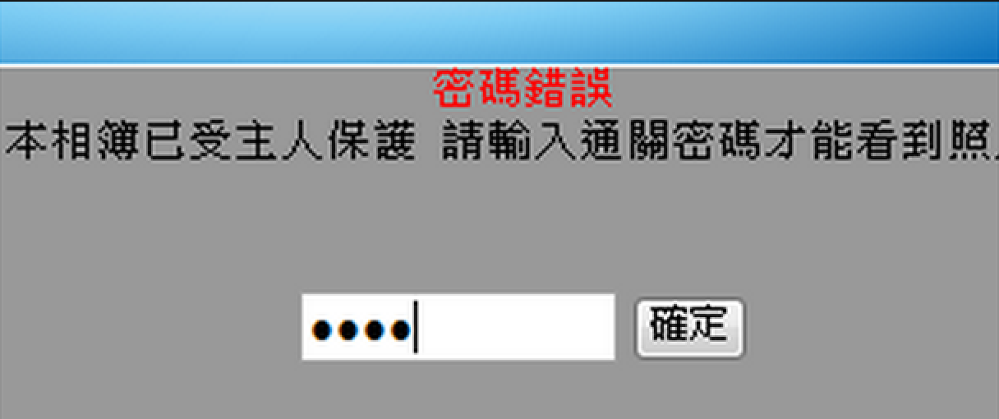

# Brute-force Attack
### 暴力破解 <!-- .element: class="fragment" -->

# 無限猴子定理

note: 無限猴子定理的表述如下：讓一隻猴子在打字機上隨機地按鍵，當按鍵時間達到無窮時，幾乎必然能夠打出任何給定的文字，比如莎士比亞的全套著作。
在這裡，幾乎必然是一個有特定含義的數學術語，「猴子」也不是一隻真正意義上的猴子，它被用來比喻成一個可以產生無限隨機字母序列的抽象設備。這個理論說明把一個很大但有限的數看成無限的推論是錯誤的。猴子精確地通過鍵盤敲打出一部完整的作品比如說莎士比亞的哈姆雷特，在宇宙的生命周期中發生的機率也是極其低的，但並不是零。

這個理論的變化形式包括多個甚至無限多個打字員，以及目標文本從一個完整的圖書館到一個簡單的句子。這些表述可以追述到亞里士多德的《論產生和毀滅》和西塞羅的的《論神之本性》，經過布萊茲·帕斯卡和喬納森·斯威夫特，最後到現在的形象的打字員的表述形式。在20世紀早期，埃米爾·博雷爾和亞瑟·愛丁頓運用這個理論在統計力學基礎中闡述隱式時間標尺。

# 窮舉法

note: 一種密碼分析方法

---

# 防
## 複雜的密碼

# 你的密碼夠安全嗎？

# 0 - 9
### (\_ \_ \_ \_) <!-- .element: class="fragment" -->
### $10^4 = 10,000$ <!-- .element: class="fragment" -->
### < 0.002 秒 <!-- .element: class="fragment" -->

# a-z + 0-9
### (\_ \_ \_ \_) <!-- .element: class="fragment" -->
### $(26 + 26 + 10)^4 = 14,776,336$ <!-- .element: class="fragment" -->
### < 0.033 秒 <!-- .element: class="fragment" -->

# a-z + 0-9
### (\_ \_ \_ \_ \_ \_ \_ \_ ) <!-- .element: class="fragment" -->
### $(26 + 26 + 10)^8 = 14,776,336$ <!-- .element: class="fragment" -->
### < 5 天 <!-- .element: class="fragment" -->

# a-z + 0-9 + 符號 <!-- .element: class="fragment" -->
### (\_ \_ \_ \_ \_ \_ \_ \_ ) <!-- .element: class="fragment" -->
### $126^8 = 63,527,879,748,485,376$ <!-- .element: class="fragment" -->
### < 4 年 <!-- .element: class="fragment" -->

---

# 攻
## 字典檔
note: 當然如果破譯一個有8位而且有可能擁有大小寫數字、字母、以及符號的密碼用普通的家用電腦可能會用掉幾個月甚至更多的時間去計算，其組合方法可能有幾千萬億重種組合。這樣長的時間顯然是不能接受的。其解決辦法就是運用字典，所謂「字典」就是給密碼鎖定某個範圍，比如英文單詞以及生日的數字組合等，所有的英文單詞不過10萬個左右這樣可以大大縮小密碼範圍，很大程度上縮短了破譯時間。

### 1989, 11, 23, tony, jian, tonytonyjan

<!-- .slide: data-background="img/tony-pwd.png" -->

# tony1123
note: 這是我看過最多人的密碼的樣子

# 1123tony

---

# 業界怎麼做？

# 註冊 = 交出密碼？

---

# 防
## 加密
## 明碼 -（雜湊方程式）-> 密碼 <!-- .element: class="fragment" -->
note: 業界的網站通常會加密

加密會有兩個特性，第一個就是密碼不能讓人看懂，第二個就是不要讓人看出來你怎麼算的

# 加密演算法
note: 所以加密演算法顯得非常重要

### 123 -> 234
### abc -> bcd
### tonytonyjan -> upozupozkbo

### 凱薩加密法 <!-- .element: class="fragment" -->
note: 這是著名的凱賽加密法，不過有個缺點就是可逆，如果要存密碼，這顯然是不合格的。

## 常見的加密演算法
* MD5
* SHA1
* SHA2
* etc

## MD5
### tony1123 -> b6d0a213e3315aab0b2aa811794e3bc4
### 1123tony -> 04fe37e7962627e6189d65a206e1fc90
note: 你大可放心，因為一般網站的資料庫不是這樣存的。

不知道各位有沒有印象，你上網的時候如果忘記某個網站的密碼，通常會怎麼做？沒錯，點選忘記密碼後，回答一些問題然後收到一封「重設密碼的信」，為什麼不直接給你而教你去重新設密碼呢，這就是原因了。

---

# 錯誤示範
## [NCC](NCC.pdf)
note: 國家通訊委員會
要找錯誤示範最好的例子就是政府的網站，也就是網只是 gov 結果，或是網站名稱有國家兩個字的。

---

# 案例介紹

## 無名小站 <!-- .element: class="fragment" -->

## PCHome 新聞台

---

# Q & A
### 想發問請舉手