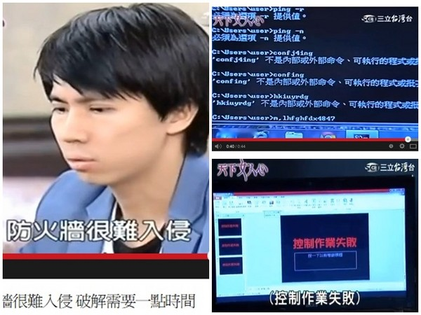

# 駭客攻防

### Brute-force Attack<!-- .element: class="fragment" -->
### SQL Injection<!-- .element: class="fragment" -->
### XSS <!-- .element: class="fragment" -->

note: 今天的主題主要包括駭客的介紹，包括駭客的定義，以及臺灣的駭客社群。之後會有三單元，每一個單元都會講述他們攻擊的手法，以及防禦的方式。

- 駭客與黑客
- 台灣駭客社群
- 台灣駭客年會介紹
- 常見攻擊手段介紹
- Brute-force Attack
- SQL Injection
- XSS

---

# 駭客？

note: 在你們認知的駭客是什麼樣子呢？

http://hackertyper.com

# 駭客（Hacker）
## 擁有熟練電腦技術的人 <!-- .element: class="fragment" -->
<h2 class="fragment"><del>入侵電腦的人</del></h2>

note: 先來一些術語介紹，駭客泛指電腦很厲害的人，並不是入侵電腦的人，入侵電腦的人叫做黑客。

# 駭客有幾種？

note: 斯斯有三種，駭客也有三種，而且分類是用帽子分的

# 白帽駭客
## 有能力破壞電腦安全但不具惡意

<h1>黑帽駭客</h1>

## 危害社會的駭客 

<h1 class="fragment">Cracker</h1>

# 灰帽駭客
## 遊走法律邊緣

note: 在資訊保安裡，「黑客」指研究智取電腦保安系統的人員。利用公共通訊網路，如網際網路和電話系統，在未經許可的情況下，載入對方系統的被稱為黑帽駭客（英文：black hat，另稱cracker）；偵錯和分析電腦保安系統的白帽駭客（英語：white hat）。「駭客」一詞最早用來稱呼研究盜用電話系統的人士。

在業餘電腦方面，「駭客」指研究修改電腦產品的業餘愛好者。1970年代，很多的這些群落聚焦在硬體研究，1980和1990年代，很多的群落聚焦在軟體更改（如編寫遊戲模組、攻克軟體版許可權制）。
「駭客」是「一種熱衷於研究系統和計算機（特別是網路）內部運作的人」。

另外駭客也不盡然都躲在黑暗中行動。

假設今天我意外從交大的網站拿到所有學生的大頭照，如果是一個黑帽駭客的話，會怎麼做？白帽駭客的話又會怎麼做？

<!-- .slide: data-background="img/game.png" -->

---

# 駭客社群

## http://hitcon.org
<!-- .slide: data-background="img/hitcon.jpg" -->

note: CIH（英語又稱為Chernobyl或Spacefiller）是一種電腦病毒，其名稱源自它的作者，當時仍然是台灣大同工學院（現大同大學）學生陳盈豪的名字拼音或注音（Chen Ing-hau）縮寫。它被認為是最有害的廣泛傳播的病毒之一，會破壞使用者系統上的全部訊息，在某些情況下，會重寫系統的BIOS。因為CIH病毒的1.2和1.3版發作日期為4月26日（第一版本病毒創造出來的時間），正好是前蘇聯（位於今日烏克蘭）核電廠災害「車諾比核事故」的紀念日，故曾被認為病毒作者撰寫動機和車諾比事件有關，因此CIH病毒也被稱作車諾比（Chernobyl）病毒。

## http://fb.me/hitcon
<!-- .slide: data-background="img/hitcon-fb.png" -->

## http://defcon.org
<!-- .slide: data-background="img/defcon.jpg" -->