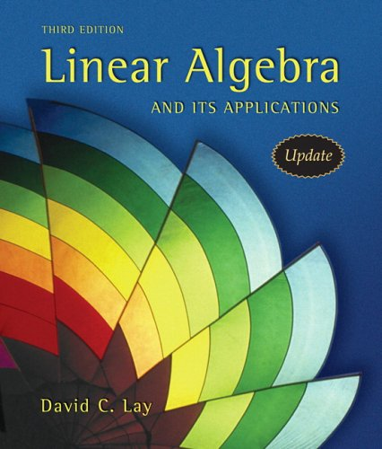
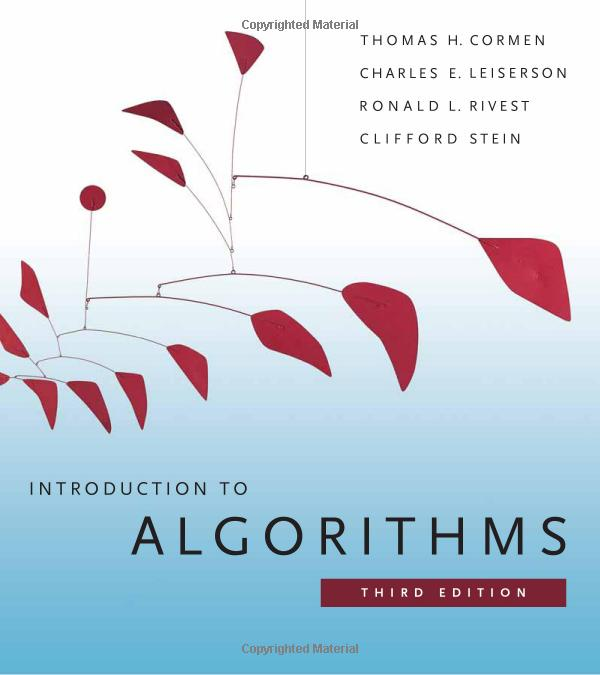
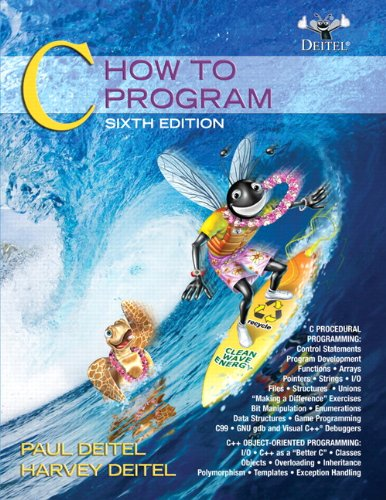
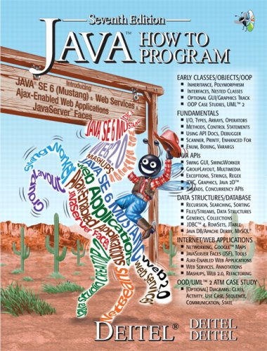

# A Markdown Based Blogging System

[簡煒航](http://tonytonyjan.net) / Jian Weihang / [@tonytonyjan](http://fb.me/tonytonyjan)

note: Hello, I am going to introduce you my new blogging system that I made few months ago.

---

<!-- .slide: data-background="img/nctu.jpg" -->
note: Before that, let's begin with my college life first. I was a student styding in National Chiao Tung University, majoring in computer science.

---

<!-- .slide: data-background="img/cs-student.jpg" -->
note: As a cs student, I got a lot of compulsory courses, such as 

<!-- .slide: data-background="img/books.jpg" -->

note: et cetera. Wow, good old days, ahh?

---

<!-- .slide: data-background="img/making-note.jpg" -->

note: Inevitably, we all make some notes at lectures if we are diligent student. I heard that some of people don't event make notes. But since I am not, I usually make notes, it's a good habit to keep you remembering some emphasis.

---

<!-- .slide: data-background="img/handwriting.jpg" -->
note: This is what a hand-writing note could look like. Generally, it is composed of paragraphs.

---

<!-- .slide: data-background="img/handwriting-2.jpg" -->
note: Sometimes, we have to write math formula.

---

<!-- .slide: data-background="img/handwriting-3.jpg" -->
note: or event programming language.

Those stuffs is commonly written in my notebook since I majored in computer science.

Everything seems to be fine until I encountered a problem one day, the problem is:

---

# I am <!-- .element: class="fragment" -->
# too lazy <!-- .element: class="fragment" -->
# to write <!-- .element: class="fragment" -->
# with pen <!-- .element: class="fragment" -->

---

<!-- .slide: data-background="img/matrix.jpg" -->
note: And I would like everything to be digitalized.

---

# What's it worth?
- Indexing <!-- .element: class="fragment" -->
- Searching <!-- .element: class="fragment" -->
- Tagging <!-- .element: class="fragment" -->
- etc <!-- .element: class="fragment" -->

---

# Markdown + Tex
# + Code Highlight <!-- .element: class="fragment" -->

note: And here is my solution. I need a markdown syntax, math formula and code highlighting supported blogging system.

Of course, I finally built it, I also gave a name to my blgging system. The name is:

---

<h1>Lagdown.com</h1>
 <!-- .element: class="fragment" -->

---

## Fork me on Github
## [tonytonyjan/lagdown](https://github.com/tonytonyjan/lagdown)

note: Lagdown is a blogging system supports markdown, Tex mathematical syntax and code highlight.

I aim to build a blogging service that belongs to we engineers and mathematician. It's a leisure project after my work, so there is no explicit schedule or plan. Join us if your are interested.

You can check our progress in milestones, or if you have any cool idea, feel to make issues letting us know, thanks a million. =)