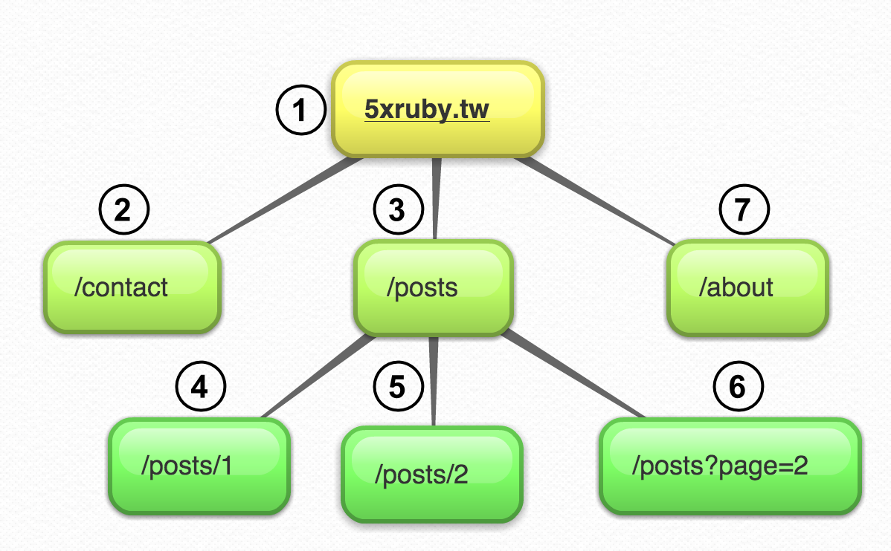
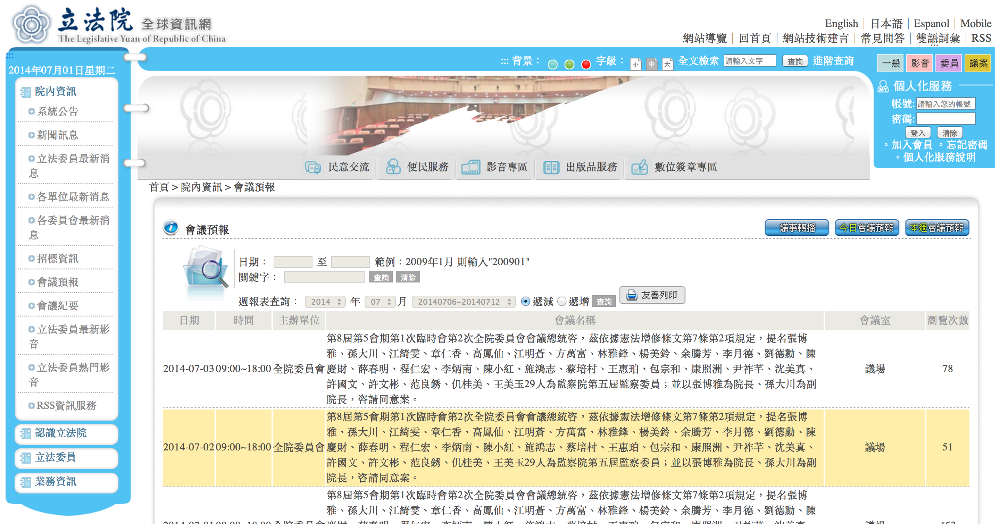

# Web Crawler <!-- .slide: data-background="../img/5xruby_bg_chapter.png" -->
## 網路爬蟲


## 資料截取科學
Information Retrieval

1. Crawling <!-- .element: class="fragment highlight-red" -->
-  Indexing & Parsing
-  Ranking


## 爬蟲的工作
1. 取得網址
2. 下載網頁
3. 截取網頁中的超連結
4. 重複動作


## 爬蟲基本策略

- 選擇（Selection）：該訪問什麼連結
  - MIME type 識別
  - 網址正規化 <!-- .element: class="fragment highlight-red" -->
  - 路徑回溯 Path-ascending crawling
- 重訪（Re-visit）： 何時重訪（Cost Function）
- 禮貌（Politeness）：robots.txt
- 併行（Parallelization）：分散式爬蟲 <!-- .element: class="fragment highlight-red" -->


## 爬蟲分類

- 全站搜索（Google, Yahoo, etc）
- 目的性（g0v） <!-- .element: class="fragment highlight-red" -->

---

# 第一隻爬蟲 <!-- .slide: data-background="../img/5xruby_bg_chapter.png" -->

---

# 下載網頁 <!-- .slide: data-background="../img/5xruby_bg_chapter.png" -->


```ruby
require 'net/http'

uri = URI('http://5xruby.tw')
Net::HTTP.get(uri) # => String
```
## 302 重導？ <!-- .element: class="fragment" -->


```ruby
require 'open-uri' # 自動處理 302 status

file = open('http://5xruby.tw')
file.read          # => String
```

---

# 取得網址 <!-- .slide: data-background="../img/5xruby_bg_chapter.png" -->


# 正規表達式


## `/href="([^"]*)"/`


### `/<a[^>]*href="([^"]*)"/`


```ruby
require 'open-uri'

file = open('http://5xruby.tw')
body = file.read
body.scan(/<a[^>]*href="([^"]*)"/)
# => Array
```


## URL 正規化
訪問網址：http://www.example.com/xxx/yyy/
<hr>
href          | 正規化之後
------------- | ----------
wWw.aBc.CoM   | www.abc.com
foo/bar       | http://www.example.com/xxx/yyy/foo/bar
/foo/bar      | http://www.example.com/foo/bar
../foo/bar    | http://www.example.com/xxx/foo/bar


```ruby
require 'uri'
uri = URI('http://www.example.com/xxx/yyy/')
```
<!-- .element: style="font-size: .9em" -->


```ruby
require 'uri'
uri = URI('http://WWW.EXAMPLE.COM')
uri.normalize
# => http://www.example.com
```


```ruby
require 'uri'
uri = URI('http://www.example.com/xxx/yyy/')
uri.merge 'foo/bar'
# => http://www.example.com/xxx/yyy/foo/bar
uri.merge '/foo/bar'
# => http://www.example.com/foo/bar
uri.merge '../foo/bar'
# => http://www.example.com/xxx/foo/bar
```
<!-- .element: style="font-size: .8em" -->


```ruby
require 'open-uri'

file = open('http://5xruby.tw/')
body = file.read
body.scan(/<a[^>]*href="([^"]*)"/) do |match|
  URI.join 'http://5xruby.tw', match[0]
end
```
<!-- .element: style="font-size: .9em" -->

## <span class="fragment">醜</span><span class="fragment">、噁心</span><span class="fragment">、不輕鬆</span>

---

# Nokogiri 鋸 <!-- .slide: data-background="../img/5xruby_bg_chapter.png" -->
支援 XPath、CSS3 的 HTML、XML 語法分析機器
```no-highlight
gem install nokogiri
```
```ruby
require 'nokogiri'
```


## CSS 選取器

JavaScript with jQuery
```javascript
$('#container > .items')
```

Ruby with Nokogiri
```ruby
doc.css('#container > .items')
```


## 結點處理

JavaScript
```javascript
node.href
$(node).attr('href')
node.innerText
$(node).text()
```

Ruby with Nokogiri
```ruby
node['href']
node.text
```


```ruby
require 'open-uri'
require 'nokogiri'
uri = URI('http://tonytonyjan.net').normalize
doc = Nokogiri::HTML(open(uri))
a_tags = doc.css('a') # => array of node
a_tags.each do |a_tag|
  uri.merge(a_tag['href'])
end
```

---

# 反覆執行 <!-- .slide: data-background="../img/5xruby_bg_chapter.png" -->
### 該怎麼重複下載與截取網址？


## 遞徊？
```ruby
def crawl uri=URI('http://abc.net')
  doc = Nokogiri::HTML(open(uri))
  a_tags = doc.css('a')
  a_tags.each do |a_tag|
    crawl uri.merge(a_tag['href'])
  end
end
```
## <span class="fragment">浪費</span><span class="fragment">、噁心</span><span class="fragment">、不好讀</span>


## 遞迴只應天上有
## 凡人該當用迴圈


# 身為凡人


## 遞徊轉迴圈
- 堆疊 - 深度搜尋
- 佇列 - 廣度搜尋


## 堆疊 - 深度搜尋



## 佇列 - 廣度搜尋


```ruby
require 'open-uri'
require 'nokogiri'
queue = ['http://tonytonyjan.net'] # +
loop do
  uri = URI(queue.shift).normalize # +
  doc = Nokogiri::HTML(open(uri))
  a_tags = doc.css('a')
  a_tags.each do |a_tag|
    queue.push uri.merge(a_tag['href']) # +
  end
end
```
<!-- .element: style="font-size: .8em" -->


## 標準爬蟲架構


---

# 持續性 <!-- .slide: data-background="../img/5xruby_bg_chapter.png" -->
### 中斷後再執行要重新爬？


## 跌倒了要再「爬」起來


## 佇列不要放記憶體

- 避免重新來過 <!-- .element: class="fragment" -->
- 併行（Parallelization） <!-- .element: class="fragment" -->


# Redis
### Mutually Exclusive List


```ruby
require 'redis'
redis = Redis.new
redis.rpush :my_queue, 'foo'
redis.lpop :my_queue # => 'foo'
```


## 回顧
```ruby
require 'open-uri'
require 'nokogiri'
queue = ['http://tonytonyjan.net'] # +
loop do
  uri = URI(queue.shift).normalize # +
  doc = Nokogiri::HTML(open(uri))
  a_tags = doc.css('a')
  a_tags.each do |a_tag|
    queue.push uri.merge(a_tag['href']) # +
  end
end
```
<!-- .element: style="font-size: .8em" -->


## Redis 版
```ruby
require 'open-uri'
require 'nokogiri'
require 'redis'
REDIS = Redis.new
loop do
  uri = URI(REDIS.lpop(:my_queue)).normalize # +
  doc = Nokogiri::HTML(open(uri))
  a_tags = doc.css('a')
  a_tags.each do |a_tag|
    REDIS.rpush :my_queue, uri.merge(a_tag['href']) # +
  end
end
```
<!-- .element: style="font-size: .7em" -->

---

# 處理空佇列 <!-- .slide: data-background="../img/5xruby_bg_chapter.png" -->


```ruby
loop do
  uri = URI(REDIS.lpop(:my_queue)).normalize # 萬一空的
end
```
<!-- .element: style="font-size: .75em" -->


```ruby
loop do
  next unless url = REDIS.lpop(:my_queue)
  uri = URI(url).normalize
end
```
<!-- .element: style="font-size: .75em" -->


```ruby
loop do
  sleep 1 until url = REDIS.lpop(:my_queue)
  uri = URI(url).normalize
end
```
<!-- .element: style="font-size: .75em" -->

---

# 異常處理 <!-- .slide: data-background="../img/5xruby_bg_chapter.png" -->
### 400 & 500


```ruby
doc = Nokogiri::HTML(open(uri)) # 警戒區
a_tags = doc.css('a')
a_tags.each do |a_tag|
  REDIS.rpush :my_queue, uri.merge(a_tag['href'])
end
```
<!-- .element: style="font-size: .75em" -->


## 策略
- 忽略
- 重試幾次
- 晚點訪問


```ruby
begin
  doc = Nokogiri::HTML(open(uri))
  a_tags = doc.css('a')
  a_tags.each do |a_tag|
    REDIS.rpush :my_queue, uri.merge(a_tag['href'])
  end
rescue
  REDIS.rpush QUEUE_NAME, uri # 重新佇列
end
```
<!-- .element: style="font-size: .75em" -->

---

# 優雅的結束 <!-- .slide: data-background="../img/5xruby_bg_chapter.png" -->
### Gracefully Exit


## 回顧 - Redis 版
```ruby
require 'open-uri'
require 'nokogiri'
require 'redis'
REDIS = Redis.new
loop do
  uri = URI(REDIS.lpop(:my_queue)).normalize
  doc = Nokogiri::HTML(open(uri))
  a_tags = doc.css('a') # Ctl + C？
  a_tags.each do |a_tag|
    REDIS.rpush :my_queue, uri.merge(a_tag['href'])
  end
end
```
<!-- .element: style="font-size: .75em" -->

來不及 push 就被中斷了


## 訊號處理
### INT
### TERM


## Ruby Way
```ruby
Signal.trap('INT'){  }
Signal.trap('TERM'){  }
```


## 併行無窮程式的中斷策略
<h3 class="fragment">讓程序或執行緒自行解決</h3>


```ruby
loop do
  exit if $should_exit # 全域布林變數
end
```


```ruby
Signal.trap('INT'){ $exit = true }
Signal.trap('TERM'){ $exit = true }
loop do
  exit if $exit
end
```


## Redis 版
```ruby
require 'open-uri'
require 'nokogiri'
require 'redis'
REDIS = Redis.new
loop do
  uri = URI(REDIS.lpop(:my_queue)).normalize
  doc = Nokogiri::HTML(open(uri))
  a_tags = doc.css('a')
  a_tags.each do |a_tag|
    REDIS.rpush :my_queue, uri.merge(a_tag['href'])
  end
end
```
<!-- .element: style="font-size: .75em" -->


## Redis 優雅中斷版
```ruby
require 'open-uri'
require 'nokogiri'
require 'redis'
REDIS = Redis.new
Signal.trap('INT'){ $exit = true }
Signal.trap('TERM'){ $exit = true }
loop do
  exit if $exit
  uri = URI(REDIS.lpop(:my_queue)).normalize
  doc = Nokogiri::HTML(open(uri))
  a_tags = doc.css('a') # Ctl + C？
  a_tags.each do |a_tag|
    REDIS.rpush :my_queue, uri.merge(a_tag['href'])
  end
end
```
<!-- .element: style="font-size: .63em" -->

---

# 儲存 <!-- .slide: data-background="../img/5xruby_bg_chapter.png" -->
### 爬到的網址和要怎麼存？


# 檔案系統
## v.s.
# 資料庫


### 檔案系統常見問題、陷阱
- 檔名 <!-- .element: class="fragment" -->
  - 網址檔名？整串網址？斜線問題？編碼？ <!-- .element: class="fragment" -->
- 檢索 <!-- .element: class="fragment" -->
  - 檔案太大、讀取較慢 <!-- .element: class="fragment" -->
- 檔案結構 <!-- .element: class="fragment" -->
  - 巢狀？平坦化？ <!-- .element: class="fragment" -->


## 資料庫優點
- 便於檢索
- 無檔名問題
- 讀取較開關檔案快


## 資料結構
-  一個網址對應一個網頁
- URL => Page
- Key-value 結構

# 還是 Redis <!-- .element: class="fragment" -->


```ruby
require 'redis'
redis = Redis.new
redis.get 'user:name' # => nil
redis.set 'user:name', 'Tony'
redis.get 'user:name' # => 'Tony'
```


```ruby
loop do
  uri = URI(REDIS.lpop(:my_queue))
  doc = Nokogiri::HTML(open(uri))
  REDIS.set "page:#{uri}", doc # 儲存
  a_tags = doc.css('a')
  a_tags.each do |a_tag|
    REDIS.rpush :my_queue, uri.merge(a_tag['href'])
  end
end
```
<!-- .element: style="font-size: .75em" -->

---

# 實際應用 <!-- .slide: data-background="../img/5xruby_bg_chapter.png" -->


## 立法院會議預報
http://www.ly.gov.tw/01_lyinfo/0109_meeting/meetingList.action




## 第一步：定址

預報單頁
```css
#item > tbody > tr > td:nth-child(4) > a
```

<hr>
下一頁
```css
.pagelinks > a:nth-last-of-type(2)
```


## 第二步：播種

```bash
redis-cli rpush url_queue "http://www.ly.gov.tw/.../meetingList.action"
```
<!-- .element: style="font-size: .6em" -->


## 第三步：開爬
事前準備
```ruby
require 'nokogiri'
require 'open-uri'
require 'redis'
QUEUE_NAME = :url_queue
CSS = '#item > tbody > tr > td:nth-child(4) > a,.pagelinks > a:nth-last-of-type(2)'
REDIS = Redis.new
```


```ruby
Signal.trap('INT') { $exit = true }; Signal.trap('TERM'){ $exit = true }
loop do
  sleep 1 until url = REDIS.lpop(QUEUE_NAME) || $exit
  exit if $exit
  uri = URI(url).tap(&:normalize!)
  puts "POP:  #{uri}"
  begin
    doc = Nokogiri::HTML(open(uri))
    REDIS.set "page:#{uri}", doc
    links = doc.css(CSS).map{|anchor| uri.merge(anchor['href']) }
    links.each{|link| REDIS.rpush QUEUE_NAME, link; puts "PUSH: #{link}" }
  rescue
    puts $!.inspect, $@
    REDIS.rpush QUEUE_NAME, url
  end
end
```
<!-- .element: style="font-size: .5em" -->