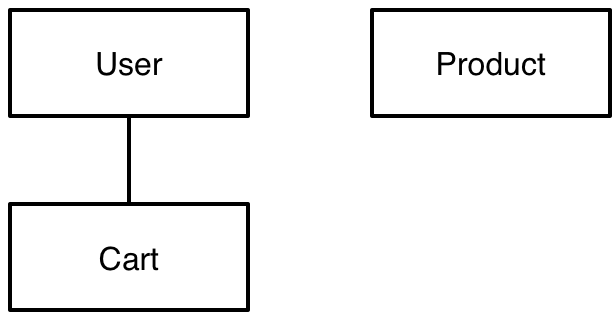

# 購物車實作 <!-- .slide: data-background="../img/5xruby_bg_title.png" -->

---

生活中的例子


## 買東西的步驟
1. 拜訪賣場
2. 取得購物車
3. 將東西放入購物車
4. 結賬

---

## 打造購物車 <!-- .slide: data-background="../img/5xruby_bg_chapter.png" -->


## 1 個人有 1 個購物車



1 to 1


```bash
$ rails g model cart user:references
$ rails db:migrate
```

有別種寫法：

```bash
$ rails g model cart user_id:integer:index
```
<!-- .element: style="font-size: .95em;" -->

這效果一樣，但差在產生的 model 需要自己補上 `belongs_to` 關聯方法


```ruby
# app/models/cart.rb
class Cart < ActiveRecord::Base
  belongs_to :user
end
```

```ruby
# app/models/user.rb
class User < ActiveRecord::Base
  ...
  has_one :cart 
end
```


## `belongs_to` vs `has_one`

取決於 forign key 在哪一張 table

情境                   | User             | Cart
---------------------- | ---------------- | ----------------
user_id in cart table  | has_one :cart    | belongs_to :user
cart_id in users table | belongs_to :cart | has_one :user


```ruby
user.cart
user.build_cart
# c = Cart.new
# c.usr = @user
```
```ruby
user.create_cart
# c = Cart.new
# c.usr = @user
# c.save
```


```ruby
user = User.find 1
5.times{ user.create_cart }
```
## Problem?


```ruby
Cart.count # => 5
Cart.pluck :user_id
# => [nil, nil, nil, nil, 1]
# 只有一個購物車的 `user_id` 有值
```


## 保持資料庫整潔
```ruby
# app/models/user.rb
has_one :cart, dependent: :destroy
```

- `User#create_cart` 在創造新的購物車會把舊的刪掉
- `User#destroy` 的同時，會觸發 `Cart#destroy`

---

## 購物車項目 <!-- .slide: data-background="../img/5xruby_bg_chapter.png" -->


## 1 個購物車有多個商品


many to many 需要額外開 table


## line_items table


cart_id | product_id | volume
------- | ---------- | ------
1       | 2          | 10
1       | 3          | 2
2       | 11         | 100000


```bash
$ rails g model line_item cart:references product:references volume:integer
$ rake db:migrate
```
<!-- .element: style="font-size: .55em;" -->

新增 `cart_id`、`product_id` 和 `volume` 3 個欄位，`_id` 結尾的是 forign key


```ruby
# app/models/line_item.rb
class LineItem < ActiveRecord::Base
  belongs_to :cart
  belongs_to :product
end
```

```ruby
# app/models/cart.rb
class Cart < ActiveRecord::Base
  belongs_to :user
  has_many :line_items
end
```

```ruby
# app/models/product.rb
class Product < ActiveRecord::Base
  belongs_to :category
  has_many :line_items
end
```


## CRUD 操作
```ruby
cart = user.cart
line_items = cart.line_items
line_items.new product: product, volume: 2
line_items.create product: product, volume: 2
line_items.find product.id
line_items.find_by product: product
line_items.clear
line_items.first.destroy
```
<!-- .element: style="font-size: .9em;" -->


## 假資料

```ruby
# lib/tasks/fake.rake
task cart: :environment do
  products = Product.all
  User.find_each do |user|
    cart = user.cart || user.create_cart
    10.times{ cart.line_items.create product: products.sample, volume: rand(10) + 1 }
  end
end
```
`find_each` 用於資料庫的批次處理因為，`User.all.each` 會一次將資料庫的資料載入記憶體，如果有數千萬筆會員資料，記憶體會不夠。

---

## 顯示購物車 <!-- .slide: data-background="../img/5xruby_bg_chapter.png" -->


```bash
$ rails g controller carts show --helper=false --assets=false
```
<!-- .element: style="font-size: .65em;" -->

```ruby
# config/routes.rb
get :cart, to: 'carts#show'
```
<!-- .element: style="font-size: .9em;" -->


```ruby
# app/controllers/carts_controller.rb
class CartsController < ApplicationController
  before_action :authenticate_user! # 只有登入的人才可訪問
  def show
    @cart = current_user.cart || current_user.create_cart
    # 如果找不到使用者的購物車就新增一個
  end
end
```
<!-- .element: style="font-size: .7em;" -->


```no-highlight
<!-- app/views/layouts/_navbar.html.erb -->
<%= nav_li '我的購物車', cart_path %>
```
<!-- .element: style="font-size: .9em;" -->

```no-highlight
<!-- app/views/carts/show.html.erb -->
<% @cart.line_items.each do |item| %>
  產品：<%= item.product.name %>
  數量：<%= item.volume %>
<% end %>
```

---

## 將產品加入購物車 <!-- .slide: data-background="../img/5xruby_bg_chapter.png" -->


## Restful
```ruby
# config/routes.rb
resources :line_items, only: %i[create destroy]
```
<!-- .element: style="font-size: .9em;" -->

HTTP 動詞 | 路徑            | Controller#Action
--------- | --------------- | -----------------
POST      | /line_items     | line_items#create
DELETE    | /line_items/:id | line_items#destroy


## LienItmesController
```no-highlight
$ rails g controller line_items --assets=false --helper=false
```
<!-- .element: style="font-size: .6em;" -->


## `line_items#create`

```ruby
# app/controllers/lineitems_controller.rb
before_action :authenticate_user!
def create
  cart = current_user.cart || current_user.create_cart
  product = Product.find params[:product_id]
  line_item = cart.line_items.new product: product, volume: params[:volume]
  if line_item.save
    redirect_to product, notice: '已加入購物車'
  else
    redirect_to product, alert: '無法加入購物車'
  end
end
```
<!-- .element: style="font-size: .55em;" -->

期待使用者傳來 `product_id` 與 `volume` 兩個變數

```html
<!-- app/views/products/show.html.erb -->
<%= 
  link_to '加入購物車',
    line_items_path(product_id: @product.id, volume: 1),
    method: :post
%>
```
<!-- .element: style="font-size: .75em;" -->


```ruby
# app/controllers/lineitems_controller.rb
line_item = cart.line_items.new product: product, volume: params[:volume]
```
<!-- .element: style="font-size: .55em;" -->

## Problem?


```ruby
line_item = cart.line_items.find_or_initialize_by product: product
line_item.volume = line_item.volume.to_i + params[:volume].to_i
```
<!-- .element: style="font-size: .55em;" -->

除了 `find_or_initialize_by`，還有 `find_or_create_by`


## 指定購買數量

```no-highlight
<!-- app/views/products/show.html.erb -->
<%= form_tag line_items_path do %>
  <%= hidden_field_tag :product_id, @product.id %>
  <%= number_field_tag :volume %>
  <%= submit_tag '加入購物車' %>
<% end %>
```
<!-- .element: style="font-size: .8em;" -->

---

## 刪除項目 <!-- .slide: data-background="../img/5xruby_bg_chapter.png" -->


## 刪除單項

```ruby
# app/controllers/lineitems_controller.rb
def destroy
  line_item = LineItem.find(params[:id])
  line_item.destroy
  redirect_to cart_path, notice: '已更新購物車'
end
```
<!-- .element: style="font-size: .9em;" -->


```no-highlight
<% @cart.line_items.each do |item| %>
  <%= item.product.name %>
  <%= item.volume %>
  <%= link_to '從購物車刪除', line_item_path(item), method: :delete %>
<% end %>
```
<!-- .element: style="font-size: .6em;" -->


## 刪除全部

```ruby
# config/routes.rb
resource :cart, only: %i[show destroy]
```

```ruby
# app/controllers/carts_controller.rb
def destroy
  @cart = current_user.cart || current_user.create_cart
  @cart.destroy # @cart.line_items.clear 也可
  redirect_to cart_path
end
```
<!-- .element: style="font-size: .75em;" -->

```no-highlight
<!-- app/views/carts/show.html.erb -->
<%= link_to '清空', cart_path, method: :delete %>
```
<!-- .element: style="font-size: .8em;" -->

---

## 更新項目 <!-- .slide: data-background="../img/5xruby_bg_chapter.png" -->


```ruby
# config/routes.rb
resources :line_items, only: %i[create update destroy]
```
<!-- .element: style="font-size: .75em;" -->

```ruby
# app/controllers/line_items_controller.rb
def update
  line_item = LineItem.find(params[:id])
  line_item.volume = params[:volume]
  if line_item.save
    redirect_to cart_path, notice: '已更新數量'
  else
    redirect_to cart_path, alert: '無法更新數量'
  end
end
```
<!-- .element: style="font-size: .9em;" -->


```no-highlight
<%= form_tag line_item_path(item), method: :put do %>
  <%= number_field_tag :volume, item.volume %>
  <%= submit_tag '更新數量' %>
<% end %>
```
<!-- .element: style="font-size: .8em;" -->


## `form_for` 寫法 - 1/2

```no-highlight
<td>
  <%= form_for item do |f| %>
    <%= f.number_field :volume %>
    <%= f.submit '更新數量' %>
  <% end %>
</td>
```


## `form_for` 寫法 - 2/2

```ruby
# app/controllers/line_items_controller.rb
def update
  ...
  # line_item.volume = params[:volume]
  line_item.volume = params[:line_item][:volume]
  ...
end
```
<!-- .element: style="font-size: .8em;" -->


## 讓購物車更安全

```ruby
# app/controllers/line_items.rb
line_item = LineItem.find(params[:id])
```
```sql
SELECT * FROM line_itmes WHERE id = 'xxx';
```
<!-- .element: style="font-size: .95em;" -->

這種寫法可以任意篡改別人的購物車項目


## 安全的寫法
```ruby
cart = current_user.cart || current_user.create_cart
line_item = cart.line_items.find(params[:id])
```
<!-- .element: style="font-size: .8em;" -->

```sql
SELECT * FROM line_items WHERE id = 'xxx' AND cart_id = 'yyy';
```
<!-- .element: style="font-size: .65em;" -->