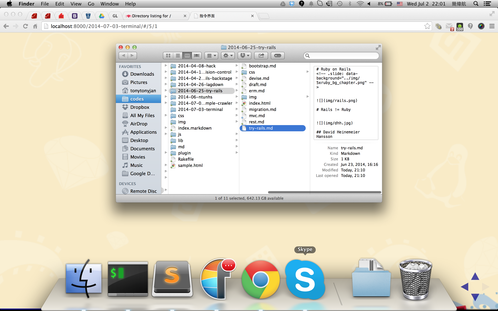
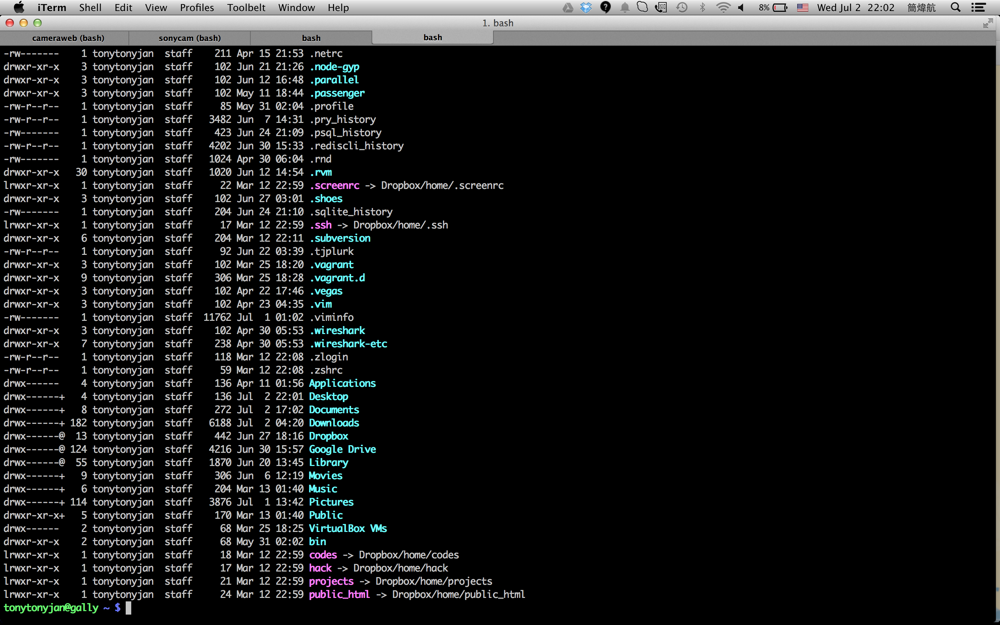

# 指令界面
### Command Line Interface


## 圖形化界面




## 指令界面




## 別名
- 指令界面（Command Line Interface）
- 終端機（Terminal）
- 主控台（Console）


# 打開指令界面
### 開始 -> 搜尋 "cmd"


## 名詞介紹

一個指令的樣子

```no-highlight
C:\Usres\Admin> cd Desktop
```

- C:\Usres\Admin：當前目錄
- cd：指令
- Desktop：參數


## 指令格式

- 指令名稱 + 參數若干
- 皆以空白相隔

---

# > dir
### directory
### 顯示當前目錄下的資訊


# > cd 資料夾名
### change directory
### 改變當目錄


# > mkdir 資料夾名
### make directory
### 新增資料夾


# > rmdir 資料夾名
### remove directory
### 刪除資料夾


# > copy 來源 目的
### 複製檔案


# > move 來源 目的
### 移動檔案


# > del 路徑
### 刪除檔案

---

## 總整理

指令           | 英文             | 說明
-------------- | ---------------- | ----------
cd 資料夾名    | change directory | 移動
mkdir 資料夾名 | make directory   | 新增資料夾
rmdir 資料夾名 | remove directory | 刪除資料夾
copy 來源 目的 |                  | 複製檔案
move 來源 目的 |                  | 移動檔案
del 路徑       | delete           | 刪除檔案


## 其他指令

- notepad
- mspaint
- start