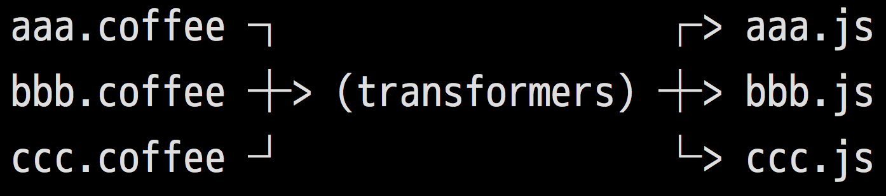
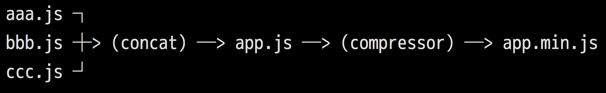
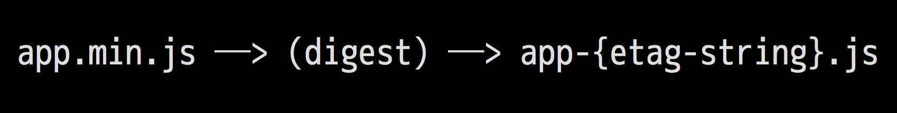
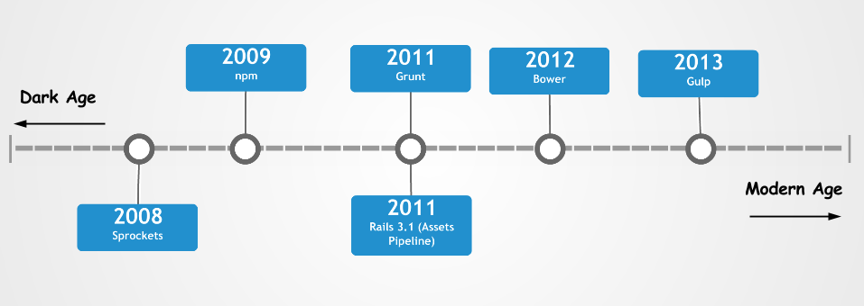
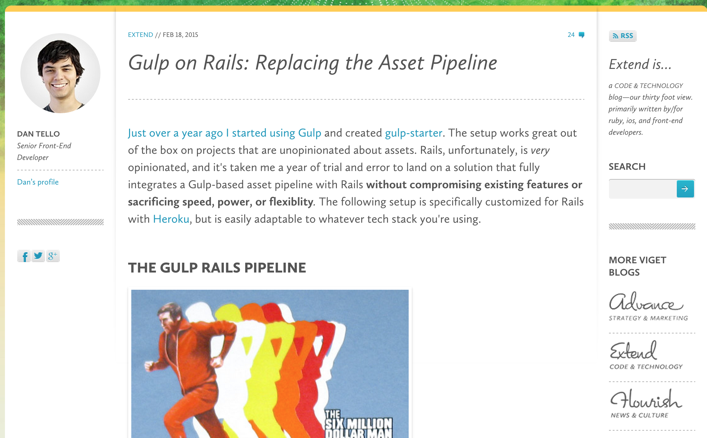
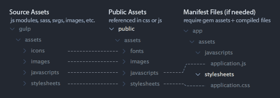
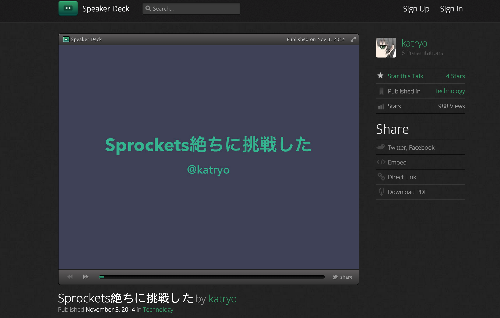
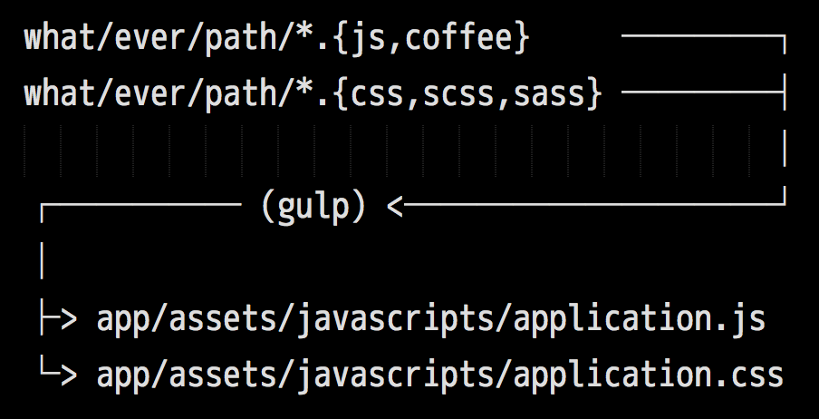

footer: @ RubyConf Taiwan, 2015
slidenumbers: true

# [fit] 還給前端一片天空
## by [@tonytonyjan](http://tonytonyjan.net)

---

# [fit] 先生不知何許人

---


---


# [fit] 大兜
# [fit] 簡煒航
# [fit] tonytonyjan

---


# 大兜 @tonytonyjan

- 技術長 - Ziltag
- 發起人 - 五倍紅寶石
- 作者 - Ruby on Rails 自習手冊
- 作者 - jaro_winkler, exif, xdite gem, etc
- 講者 - ConFoo 2015
- 講者 - Ruby Kaigi 2014

^ 這是我簡單的背景，目前在 Ziltag 擔任技術長、曾是五倍紅寶石的發起人之一、寫過一本書，也貢獻過一些開源專案，像是 exif、jaro_winkler、以及⋯⋯

^ 此外你也會在一些國際的議程上看到我的身影

---


# 特長

- C
- Ruby
  - Rails
  - C Extension
- ~~JavaScript~~
- ~~CSS~~

^ 我的特長是寫 C 語言跟 Ruby，其中 Ruby 方面又以 Rails 和 Ruby 上的 C 擴展為主要的興趣。很明顯呢，我是個後端工程師，各位可以看到下方兩個被劃掉的條目 JavaScript 與 CSS。

^ 你可能會說：「什麼，你不會前端，怎麼在台上教我前端，這樣豈不是永婕諫皮嗎？」

---


# [fit] 呵呵

---

# 講題大綱
## 還給前端一片天空

- 聽我講古
- 在 Rails 上遇到的前端問題
- 透過 JS 生態圈彌補 Rails 的不足

^ 其實也還好，事實上我不是來教前端的，而是提出一個讓前端工程師可以在 Rails 專案上揮灑的方法，今天講題就分三個部分。

---

# [fit] 很久很久以前⋯⋯

---

# 我們的黑暗時代 (1/4)

```html
<head>
  <link rel="stylesheet" href="aaa.css">
  <link rel="stylesheet" href="bbb.css">
  <link rel="stylesheet" href="ccc.css">
  <script src="aaa.js"></script>
  <script src="bbb.js"></script>
  <script src="ccc.js"></script>
</head>
```

^ 那時候開發網頁什麼工具也沒有，隨著專案的長大，head tag 裡面的東西可能會長這個樣子，不過聰明的工程師馬上就發現這樣寫會有一個問題。

---

# [fit] HTTP 請求太多

---

# 我們的黑暗時代 (2/4)
## Concatination

ex. `cat *.js`

```html
<head>
  <link rel="stylesheet" href="all.css">
  <script src="all.js"></script>
</head>
```

^ 解法很直覺啊，就是把檔案都黏起來就可以了，這用簡單的像是 cat 指令來做到，於是請求次數馬上就減少到三個，但即便如此，還是無法滿足貪心的工程師。

---

# [fit] 檔案太大

---

# 我們的黑暗時代 (3/4)
## Compression

ex. YUI Compressor

```html
<head>
  <link rel="stylesheet" href="all.min.css">
  <script src="all.min.js"></script>
</head>
```

---

# [fit] 瀏覽器快取

---

# 我們的黑暗時代 (4/4)
## 加上版本號防快取

```html
<head>
  <link rel="stylesheet" href="all.min.css?v2">
  <script src="all.min.js?v3"></script>
</head>
```

---

# [fit] 難以 debug

---

> 「我們可以用 Source Map 啊！」

---


---


---

# [fit] QQ

---

# [fit] 在這個黑暗時代
# （2011 以前）

---

# [fit] 前端網頁開發是如此麻煩

---

# [fit] 直到⋯⋯

---

# [fit] Rails 3.1
# [fit] 引進了 Assets Pipeline

---

# [fit] Sprockets

---

# Sprockets 做了些什麼 (1/4)
## Transform



---

# Sprockets 做了些什麼 (2/4)
## Concat & Compress




---

# Sprockets 做了些什麼 (3/4)
## Digest



---

# Sprockets 做了些什麼 (4/4)
## JavaScript Templating

```html
<!-- templates/hello.jst.ejs -->
<div>Hello, <span><%= name %></span>!</div>
```

```js
// application.js
//= require templates/hello
$("#hello").html(JST["templates/hello"]({ name: "Sam" }));
```

---


---

# [fit] 可是呢⋯⋯

---

# [fit] 在某些情況下

---

# [fit] 這讓有些事情變得複雜

---

# 你有可能⋯⋯

- 喜歡 TypeScript 勝過 CoffeeScript
- 喜歡 LESS 勝過 SASS
- 想用 ReactJS 或 Polymer 取代 JST
- 喜歡用 bower 管理第三方的前端套件勝過 gem
- 想要使用 Mocha、Jasmine 寫測試

---

> 「一切只要交給 gem 就好啦！」

---

# TypeScript -> typescript-rails
# LESS -> less-rails
# ReactJS -> react-rails

---

# [fit] rails-assets.org

---

# Gemfile

```ruby
source 'https://rails-assets.org' do
  # gem "rails-assets-#{BOWER_PKG_NAME}"
  gem 'rails-assets-bootstrap'
  gem 'rails-assets-angular'
  gem 'rails-assets-leaflet'
end
```

---

# [fit] 萬一沒有 gem？

---

# [fit] 可以儲存至 `vendor/assets/`

---

# [fit] 萬一 gem 太多？
# [fit] bootstrap gem 有 3 個以上

---

# [fit] 官方 gem 優先
# [fit] 熱門 gem 其次

---

# 妥協的結果：
# 部分放 `vendor/assets`
# 部分放 Gemfile

---

# [fit] 很糟糕啊⋯⋯

---

# 前端工程師的提問

- 所以我要學 JST 嗎？
- 我要學 sprockets manifest system 嗎？
- 我要怎麼安裝新的套件呢？
- 前端卡關應該求助 Ruby 社群還是 JS 社群？

---

# 工具演進史



---

# 其實前端碼農們有自己的工具
# Bower, Gulp, npm, Grunt, ...

---


# [fit] 可是在 Rails
# [fit] 通通不能用

---

# [fit] QQ

---


# [fit] Rails + Bower

---

# [fit] 你也許知道
# [fit] rails-assets.org

---

# [fit] 分享一個
# [fit] 不用 Gem 的作法

---

# .bowerrc

```json
{
  "directory": "vendor/assets/components"
}
```

或

```json
{
  "directory": "public/components"
}
```

---

# assets.rb

```ruby
Rails.application.config.assets.paths.concnat [
  'vendor/assets/components'
]
```

---

# application.scss

```scss
@import 'material-design-lite/src/material-design-lite'
```

# application.js

```js
//= require jquery
//= require jquery_ujs
//= require turbolinks
//= require material-design-lite/material
```

---

# [fit] 乍看完美

---

# 不過有幾個問題⋯⋯

- 不正確的 CSS 中的 assets 路徑
- 想使用前端世界的工具，例如：
  - Autoprefixer
  - BrowserSync
  - JSHint
  - etc

---

# 不正確的 assets 路徑

以 bootstrap 為例：

```css
@font-face {
  font-family: 'Glyphicons Halflings';
  src: url('../fonts/glyphicons-halflings-regular.eot');
}
```

---

# bower install bootstrap-sass

當然，如果有官方提供的 sprockets 設定最好不過：

```scss
@import 'bootstrap-sass/.../bootstrap-sprockets';
@import 'bootstrap-sass/.../bootstrap';
```

但不是每個 bower package 都有提供 sass 的版本。

---

# [fit] 至於想使用前端世界的工具
### （Autoprefixer、BrowserSync、JSHint、etc）

---

# [fit] 前端是 Rails
# [fit] 生態圈的不足

---

# [fit] 他山之石
# [fit] 可以攻錯

---


# [fit] Rails + Bower + gulp

---

# [fit] 看看別人怎麼做

---



---

# Dan 的檔案結構



---

# 可能有的問題

1. 各位的檔案必須這樣放
2. 多了一個叫做 `gulp_asset_path` 的 helper
3. public 有太多沒有必要的中間產物

---



---

# katryo 的工具包

- gulp-ugify
- gulp-css-minify
- gulp-concat
- gulp-rev
- gulp-rev-rails-manifest

---

# 可能有的問題

1. 完全取代了 sprockets，捨棄 gem 裡面的 assets
2. 複寫了 `asset_path` 方法以產生正確的 etag string
3. 使用 `browserfy`，巢狀相依會導致檔案變大

---

# [fit] 所以還能怎麼做呢？

---

# [fit] 在那之前

---

# [fit] 先看看問題是什麼

---

# [fit] 多想兩分鐘⋯⋯

---

# [fit] 你可以不必
# [fit] 丟掉 Sprockets

---

# 為何不捨棄 sprockets

1. 有些 assets gem 需要 sprockets 的 directive processor
2. 內建的 compression、digestion 已經做得很好

---

# [fit] 之所以使用 bower、gulp、npm 等工具

---

# [fit] 是為解決 rails 前端生態圈的不足

---

# [fit] 畢竟前端的 gem 再怎麼多

---

# [fit] 也不會比 JS 生態圈多

---

# [fit] 但也沒有必要拿掉
# [fit] sprockets 完善的部分

---

# 我想是這樣啦⋯⋯



---

# [fit] 可能的好處有⋯⋯

---

# [fit] 不用裝 gem

---

# 不用整合

- gulp-rev
- gulp-ugilfy
- gulp-css-minify
- gulp-rev-rails-manifest

# 交給 sprockets 即可

---

# [fit] 更重要的

---

# [fit] 前端的 code 前端工程師管

---

# `gulp application.js`

```coffee
gulp.task 'application.js', ->
  gulp.src [
    'app/assets/javascripts/application/manifest.js'
    'bower_components/bootstrap/dist/js/bootstrap.js'
    'bower_components/material-design-lite/material.js'
    'app/assets/javascripts/application/**/*.{coffee,js}'
  ]
  .pipe $.if(/\.coffee$/, $.coffee())
  # 可以繼續 pipe 直到前端工程師滿意
  .pipe $.concat('application.js')
  .pipe gulp.dest 'app/assets/javascripts'
```

---

# `glup serve`

```coffee
browserSync = require('browser-sync').create()

gulp.task 'serve', ->
  browserSync.init
    proxy: 'localhost:3000'
```

---

> 「可是 font 路徑怎麼解決呢？」

---

# 一般 CSS

```css
.logo {
  background-image: url(logo.png)
}
```

# sprockets SCSS helper

```scss
.logo {
  background-image: asset-url("logo.png")
}
```

---

# 使用 ERB

```css
.logo {
  background-image: url("<%= asset_path 'logo.png' %>")
}
```

這同時也是 JS 檔案中引用 assets 路徑的官方解法

---

# 處理 assets 路徑
## config/initializers/assets.rb

```ruby
Rails.application.config.assets.paths << 'vendor/assets/components'
Rails.application.config.assets.paths.concat Dir['vendor/assets/components/**/*/fonts']
Rails.application.config.assets.precompile += %w[*.eot *.woff2 *.woff *.ttf *.svg]
```

---

# 處理 assets 路徑
## Rails.application.assets.paths

```
/.../hello/app/assets/images
/.../hello/app/assets/javascripts
/.../hello/app/assets/stylesheets
/.../hello/vendor/assets/components
/.../hello/vendor/assets/javascripts
/.../hello/vendor/assets/stylesheets
/.../gems/turbolinks-2.5.3/lib/assets/javascripts
/.../gems/jquery-rails-4.0.4/vendor/assets/javascripts
/.../gems/coffee-rails-4.1.0/lib/assets/javascripts
/.../hello/vendor/assets/components
/.../hello/vendor/assets/components/bootstrap-sass/assets/fonts    *
/.../hello/vendor/assets/components/font-awesome-sass/assets/fonts *
```

---

# 處理 assets 路徑
## 路徑轉換

```erb
url(path/to/fonts/foo.svg) -> url("<%= asset_path 'foo.svg' %>")
url(../fonts/bar.eot) -> url("<%= asset_path 'bar.eot' %>")
url(fonts/buz.woff2) -> url("<%= asset_path 'buz.woff2' %>")
```

---

# 處理 assets 路徑
## 看看 bootstrap-sass 怎麼支援 Mincer

```scss
@function twbs-font-path($path) {
  // do something like following
  // from "path/to/font.ext#suffix" to "<%- asset_path(path/to/font.ext)) + #suffix %>"
  // from "path/to/font.ext?#suffix" to "<%- asset_path(path/to/font.ext)) + ?#suffix %>"
  // or from "path/to/font.ext" just "<%- asset_path(path/to/font.ext)) %>"
  @return "<%- asset_path('#{$path}'.replace(/[#?].*$/, '')) + '#{$path}'.replace(/(^[^#?]*)([#?]?.*$)/, '$2') %>";
}
```

---

# 處理 assets 路徑
## gulp-replace

```coffee
$ = require('gulp-load-plugins')()
gulp.task 'application.css', ->
  gulp.src [
    'app/assets/stylesheets/application.scss'
    'app/assets/stylesheets/application/**/*.{css,scss,sass}'
  ]
  .pipe $.concat 'application'
  .pipe $.sass
    includePaths: ['vendor/assets/components']
  .pipe $.replace /url\((['"]?)[^\1)]*fonts\/([^\1)]+)\1\)/g, "url('<%= asset_path '$2' %>')"
  .pipe $.rename 'application.css.erb'
  .pipe gulp.dest 'app/assets/stylesheets'
```

---

# 範例專案
# [fit] [`https://github.com/tonytonyjan/rails_gulp_bower`](https://github.com/tonytonyjan/rails_gulp_bower)

---

# [fit] 感謝收聽