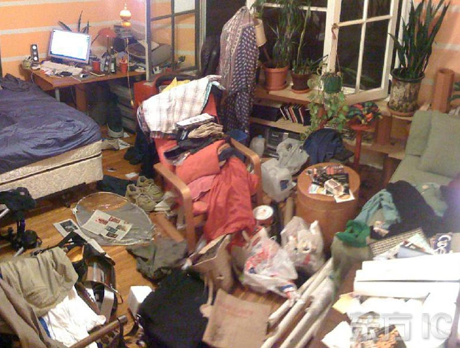

# 管理你的代碼

note: 今天會講到的主題大綱：

- 開放式原始碼
- 版本控制
- Git
- GitHub

# 為什麼？
## 沒有整理會死嗎？
note: 為什麼需要整理程式碼呢？

note: 我覺得這就跟整理房間一樣，你可以什麼都不用管，那你的房間看起來大概就像這樣，你說這種地方可以生活下去嗎？當然可以啊，只要你可以忍受。

note: 可是這樣的房間不是住起來會比較爽嗎？

（比較兩張圖）可是你覺得變成第一張比較容易，還是第二張比較容易？當然，第一張是你不用做出任何努力都可以辦到的事情，但是第二張可能就要下點功夫。但是他帶來的好處很多。

# 找東西比較快
note: 你不用大費周章把整個房間翻遍才找得到你要的東西

# 看起來舒服
note: 對眼睛比較好，看到乾淨整齊的房間整個心情就會跟著好起來，就連跟你一起住的室友（假設有）心情也會好起來。

# 改變容易
note: 歐式風格，換成日式風格什麼的，會很容易，但如果原本凌亂的房間想要改變風格，光是整理房間就會耗掉你大部分的時間。

---

## 為什麼需要整理？
- 檔案會變大 <!-- .element: class="fragment" -->
- 檔案會變多 <!-- .element: class="fragment" -->
- 工程師變多 <!-- .element: class="fragment" -->
- 時光機還沒有被發明 <!-- .element: class="fragment" -->
note: 其實還有其他需要整理的原因

## 專案規模
<table class="center">
  <thead>
    <tr>
      <th>等級</th><th>程式多少行？</th><th>有幾個檔案？</th><th>幾個人維護？</th>
    </tr>
  </thead>
  <tbody>
    <tr class="fragment">
      <td>作業</td> <td>100</td> <td>1</td> <td>1</td>
    </tr>
    <tr class="fragment">
      <td>小組</td> <td>1,000</td> <td>5</td> <td>5</td>
    </tr>
    <tr>
      <td class="fragment">Rails</td> <td class="fragment">約 30 萬</td> <td class="fragment">約 3000</td> <td class="fragment">約 2300</td>
    </tr>
    <tr>
      <td class="fragment">FireFox</td> <td class="fragment">約 70 萬</td> <td class="fragment">約 10 萬</td> <td class="fragment">約 2600</td>
    </tr>
  </tbody>
</table>
note: 各位可能對於檔案變多或是檔案變大沒什麼概念，不妨在這裡舉個例子對於管理這麼大的程式碼，如果是用肉身去管理是相當困難的，所以這時候借助一些工具去解決問題，解決什麼題呢？

---

# 難題一
## 控制版本

# SL 大法
### Save Load
note: 還記得打遊戲的時候嗎？

note: 當你的程式碼告一段落的時候，就全部存起來，如果硬碟太小，你就壓縮，前面命名加個日期提醒自己。

---

# 難題二
## 多人協作
note: 房間你是一個人住，再怎麼亂也沒關係，反正也沒有人看到，但假設今天你有一個室友要搬進來了，這下狀況就不樣了。你們的習慣可能不同，作息可能不同，對於房間的格局擺設也可能不同。

尤其如果你房間已經夠亂了還要敲請別人進來一起住，可能會被譴責一頓。

所以不整理房間到底會不會死？主要是看人喔，可能會。

# 雲端硬碟法
### Dropbox
### Google Drive

note: 他們的功能都是在你的檔案系統裡面新增一個資料夾，這個資料夾可以在你的任何設備同步，其中一個最好用也是我最愛用的功能是與他人共享一份資料夾，這樣可以與別人一起執行某個專案，或者共筆文件。

---

# 一切看似
# 沒有問題

---

## Save Load 大法
- 浪費硬碟 <!-- .element: class="fragment" -->
- 浪費時間 <!-- .element: class="fragment" -->

---

## 雲端硬碟法
- 覆蓋檔案 <!-- .element: class="fragment" -->
- 破壞感情 <!-- .element: class="fragment" -->

---

# 於是...

<!-- .slide: data-background="img/light.jpg" -->
# 版本控制工具
# 誕生了