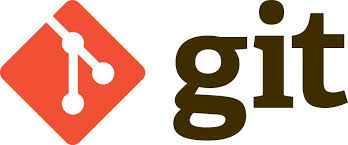
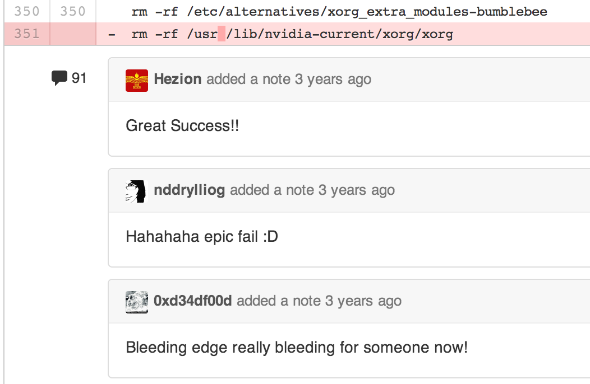

# 版本控制
## Revision Control
note: 版本控制（Revision control）是維護工程藍圖的標準作法，能追蹤工程藍圖從誕生一直到定案的過程。此外，版本控制也是一種軟體工程技巧，藉此能在軟體開發的過程中，確保由不同人所編輯的同一程式檔案都得到同步。

---

# 集中式

# CVS

- Gnome <!-- .element: class="fragment" -->
- KDE <!-- .element: class="fragment" -->
- GIMP <!-- .element: class="fragment" -->

note: CVS（Concurrent Versions System）代表協作版本系統或者並行版本系統，是一種版本控制系統，方便軟體的開發和使用者協同工作。

很多開源或者自由軟體專案都使用CVS作為其程式設計師之間的中心點，以便能夠綜合各程式設計師的改進和更改。這些專案包括：Gnome、KDE、GIMP、Wine等。CVS的使用獲GNU通用公眾授權條款授權。

缺點是檔案會被鎖定。

## SVN

- Chrome <!-- .element: class="fragment" -->

note: 在2000年初，有開發人員要寫一個CVS的自由軟體代替品，它保留CVS的基本思想，但沒有它的錯誤和局限。

---

# 分散式

- Mozilla <!-- .element: class="fragment" -->
- OpenJDK <!-- .element: class="fragment" -->

note: Mercurial 是一個跨平台的分布式版本控制軟體，主要由Python語言實作，但也包含一個用C語言實作的二進制比較工具。Mercurial一開始的主要執行平台是Linux，現在Mercurial已經被移植到Windows、Mac OS X和大多數的類Unix系統中。Mercurial主要由一個命令列程式組成，現在也有了圖形化使用者介面。對Mercurial的所有操作都由用不同的關鍵字作為參數呼叫程式「hg」來實作，Hg是參考水銀的化學符號而取的名字。

- Linux <!-- .element: class="fragment" -->
- Rails <!-- .element: class="fragment" -->
- jQuery <!-- .element: class="fragment" -->

note: 另外一個比較知名的版本控制是 git，雖然他和 mercurial 發展的時間差不多，但是真正讓他爆紅的其實是某個網站。

note: 工程師的 Facebook

<!-- .slide: data-background="img/github-2.png" -->
 <!-- .element: class="fragment" -->
note: 裡面點開可以看到他的程式碼，有時候可以看到髒話

<!-- .slide: data-background="img/github-2.png" -->

[傳送門](https://github.com/MrMEEE/bumblebee-Old-and-abbandoned/commit/a047be85247755cdbe0acce6f1dafc8beb84f2ac)
<!-- .element: class="fragment" -->

note: 也可以看得到每次改變的版本到底改了什麼，甚至可以對他的程式碼留言。也可以提交程式碼，但是雖然有些專案是 open source，可是作者並沒有 open mind 的。

<!-- .slide: data-background="img/github-2.png" -->

note: 你看這個網站這麼的厲害，但厲害的應該不是這個網站，而是 git，他裡面大概有九成的功能都是 git 內建的，但 git 是指令式的軟體，所以 github 可以看成是 git 免空網站。

且這個網站也鼓勵大家多多開源，如果你想閉源，你必須付費。

想與世界接軌，其實可試著用用看他，而且頗建議大家註冊的，因為有些公司其實面試的時候反而對你的學校或證照不感興趣，他會看你的 github 帳號，看看你的在裡面搞了什麼。所以這其實可以說是另外一種履歷。