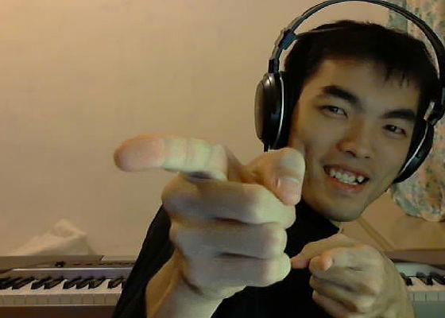
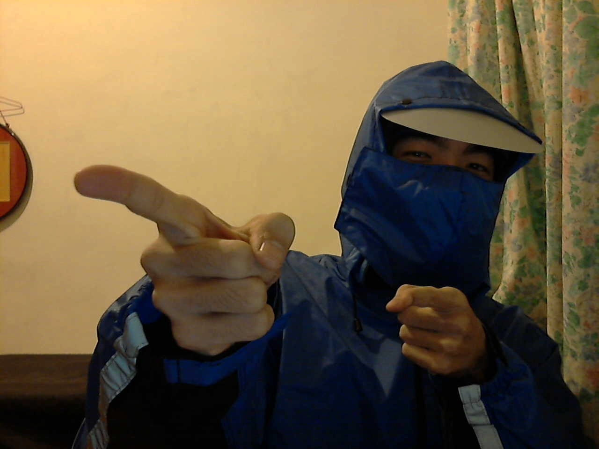
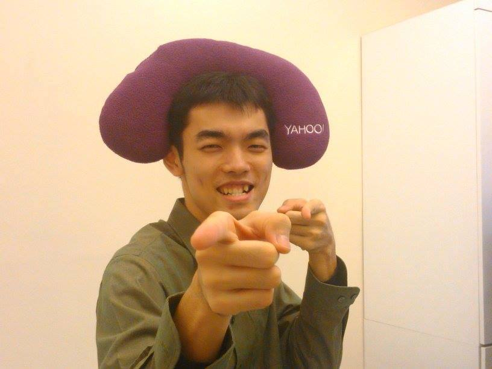
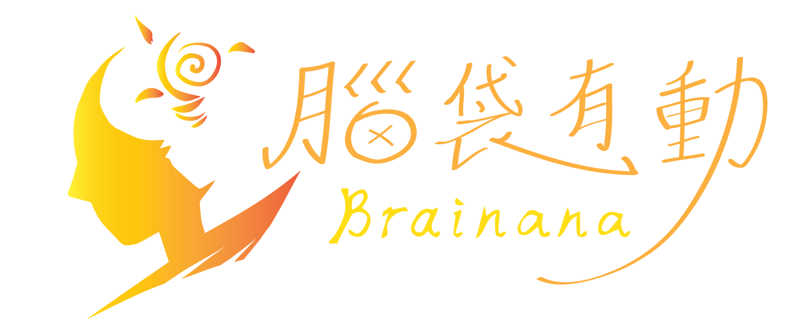

# 你哪位？
# Who are you
### 先生不知何許人

note: 我在過去的議程中從來沒有露臉過，所以先來個自我介紹。

---

<h1>簡煒航 <small>/ Jian Weihang</small></h1>
<h1 class="fragment" data-fragment-index="1">
  
大兜

</h1>

<h1 class="fragment" data-fragment-index="2">tonytonyjan
  
    
    ╳
  
  .net
</h1>

  
  
  
  

note: 我的名字叫做簡煒航，綽號大兜，網路代號 tonytonyjan，你在各大社群網站上面輸入這個帳號，都可以找到我，但記得不要和喬巴搞錯（Tony Tony Chopper）。此外我的個人網站是在帳號後面加上「.net」。

---

2011

note: 這是 3 年前的我

2012

note: 這是 2 年前的我

2013

note: 這是 1 年前的我

Nov 2013

note: 這是半年前的我，頭上那個是去年 Yahoo Hack Day 的贈送的枕頭。

---

# 學生 / Student
### 2013 交大資工系 / NCTU CS
### 在學 臺科電機所 / NTUST EE

note: 我是個學生，去年剛從交大資工畢業，現在在台科電機所念碩一，專長在網路程式設計。

# 教練 / Coach
### Rails Girls Taipei

note: 除了學生之外，我同時也是老師。我在 Rails Girls Teipei 擔任程式教練。

# 自由業 / Freelancer
### 2013 腦袋有動工作室 / Brainana Studio

網站架設、客製企業系統、電子商務

 <!-- .element: class="fragment" data-fragment-index="1" style="height:300px;" -->

http://brainana.com <!-- .element: class="fragment" data-fragment-index="1" -->

note: 此外我也是個 SOHO 族，靠接案為生，使用 Ruby 吃飯已經兩年，直到去年九月也成立了自己的工作室，負責網站架設，客製化企業系統，和電子商務。

# 員工 / Staff
### 2014 五倍紅寶石股份有限公司

程式職訓、認證、技術顧問

note: 另外這個月我和幾位朋友合夥成立了一家新的公司，成了裡面的員工。公司名稱顧名思義也是以 Ruby 為主要工具，服務項目包括程式教育、認證以及企業的技術顧問。