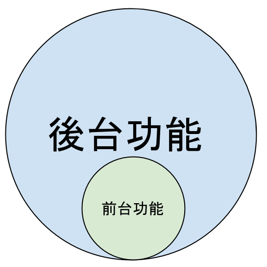
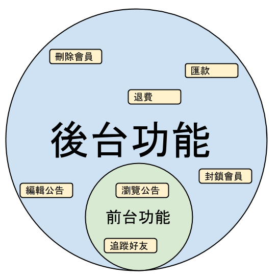
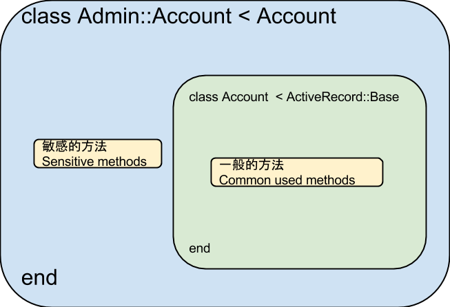
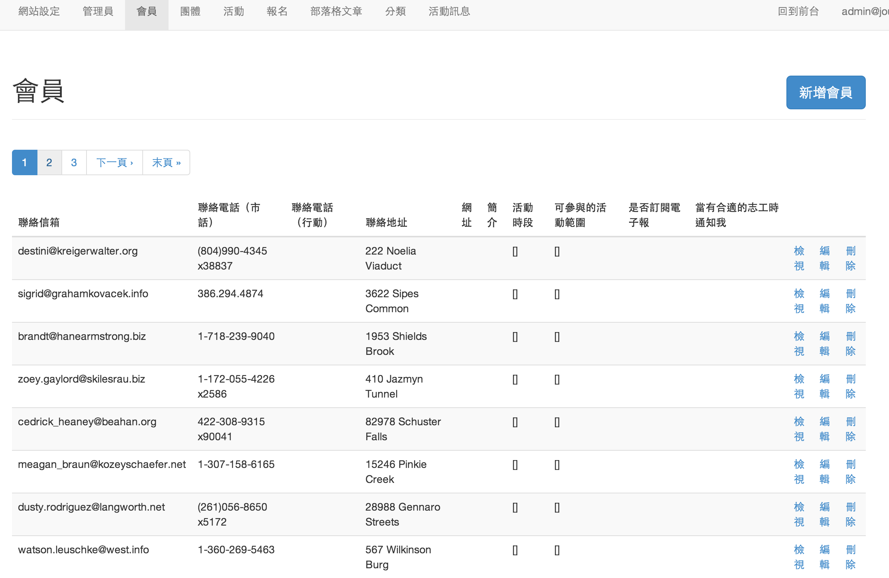
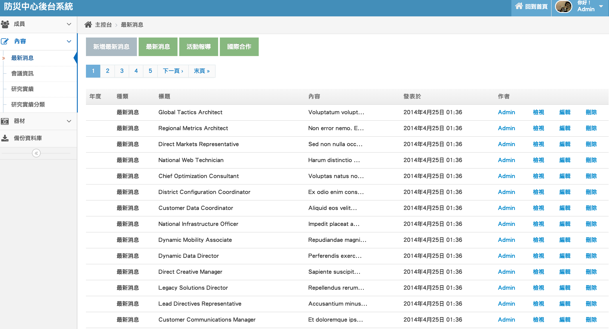

# 繼承 / Inheritance

---

<!-- .slide: data-transition="none" -->


note: 之所以想到繼承是因為目前經手的所有案件，就功能與邏輯面而言，前台永遠是後台的刪減版本。


<!-- .slide: data-transition="none" -->


note: （此處依照投影片上的圖片列舉）


<!-- .slide: data-transition="none" -->


note: 如果採用繼承的話，大概就像這張圖一樣，把敏感的一些方法丟到外面的 `Admin::Account`，一般的方法維持在原來的 `Account` 類別即可。


Admin::Account < Account

```ruby
# app/models/account.rb
class Account < ActiveRecord::Base
  ...
end

# app/models/admin/account.rb
class Admin::Account < Account
  ...
  def clear_data
    ...
  end
  def transfer_money(account)
    ...
  end
  ...
end
```

- 所有 Account 可以做的事情，Admin::Account 都可以做
- 敏感的方法被放在 Admin 名稱空間下
- Admin::Account 只會在後台的 controller 用到

note: 這樣感覺比上一版漂亮許多，除了保持只有 1 個 repository 之外，也利用名稱空間將敏感的方法隔開。我們接下來只要確保閒雜人等不會遊覽到後台的 controller 就安全了。這種方式看似沒什麼了不起，但其實好處很多。

---

# Helper

note: 第一個我們先講 Helper

---

## Single Model

前台
```ruby
link_to('foo', @post) # href="/posts/:id"
form_for(@post)       # action="/posts" or "/posts/:id"
```

<div class="fragment">
後台
<pre><code class="ruby">link_to('foo', [:admin, @post])              # href="/admin/posts/:id"
link_to('foo', admin_post_path(@post))       # href="/admin/posts/:id"
form_for(@post, url: admin_posts_path)       # action="/admin/posts"
form_for(@post, url: admin_post_path(@post)) # action="/admin/posts/:id"</code></pre>
</div>

note:
不知道各位過去有沒有遇到這類的問題，當設計後台的時候為了要重導到正確的 routing path，要在一些 url helper 上面動些手腳，以防後台的東西不小心連到前台去。

當你前後台如果共用的是同一個 model，乍看之下可能沒有什麼問題，但除了在編寫後台常常要堤防連結不小心連線到前台去之外，還要去判斷 `form_for` 裡面的 record 是編輯還是新增，再決定 url 應該填寫哪個路徑，非常麻煩。


## Using Namespace

If `@post` is an `Admin::Post`
```ruby
link_to('foo', @post) # href="/admin/posts/:id"
form_for(@post)       # action="/admin/posts/:id" or "/admin/posts"
```

但如果你特別把兩個不同的 model 分開的話，就會省事很多。

---

### 路由 / Routes

```ruby
# routes.rb
Rails.application.routes.draw do
  namespace :admin do
    resources :posts, :comments, :accounts
  end
end
```

### Controller

```ruby
# app/controllers/admin/posts_controller.rb
class Admin::PostsController < ApplicationController
  def show
    @post = Admin::Post.find(params[:id])
  end
end
```

note: 這也意味著我們的路由也要用名稱空間包起來，而同時最好也要有相對應的 controller。

---

## 流程

假設我們有一個 `Post` model

1. 修改 `routes.rb`
2. 新增 `app/models/admin/post.rb`
3. `app/controllers/admin/posts_controller.rb`
4. `app/views/admin/posts/{index,new,edit}.html.erb`

note: 在這樣的架構下，要為一個既有的 model 新增一個後台介面，所需要的步驟有這 4 個。我一開始是乖乖這樣做的，但不知道各位對於這些手動的流程有沒有覺得眼熟，沒錯，實際上可以更懶，因為這些工作可以用 rails scaffold generator 來完成。

---

## 實際上的流程

rails g scaffold admin/post <span class="fragment">--migration=false</span> <span class="fragment">--parent=Post</span>

<div class="fragment">
搭配 scaffold template 食用效果佳
<pre><code class="bash">lib
└── templates
    └── erb
        └── scaffold
            ├── _form.html.erb
            ├── edit.html.erb
            ├── index.html.erb
            ├── new.html.erb
            └── show.html.erb</code></pre>
</div>

note: 所以實際上的流程只要下一個指令就好，因為要使用已經存在的 table，所以不應該跑 migration，然後要繼承自既有的 model，所以加個 parent，就完成了。

此外再搭配 scaffold template 一起使用的話，只要 template 寫的好，我覺得這種方法並不會比使用之前介紹的 gem 還要遜色。







---

# 注意事項
# Warning


admin.rb

```ruby
module Admin
  def self.table_name_prefix
    # 'admin_'
  end
end
```

note: 使用 scaffold 時候如果有有給定名稱空間，就會多一個檔案，目的為了讓 model 可以對應到正確的 table，但由於 `Admin::Post` 和 `Post` 共用的是同一張 table，所以在這裡註解掉是必要的。


## STI
當有下列情況發生的時候：
```ruby
class Teacher < User
  ...
end

class Student < User
  ...
end

class Admin::User < User
  self.inheritance_column = nil
end
```

```ruby
Teacher.all     # where(type: 'Teacher')
Student.all     # where(type: 'Student')
Admin::User.all # where(type: 'Admin::User')
```

```ruby
class Admin::User < User
  self.inheritance_column = nil
end
```

note: STI（Single Table Inherit）在網站架設時算是一個很普遍的技巧，而在 Active Record 裡面用來判斷的依據是 table 裡有沒有 column 命名為 type。

假設我們的 `User` model 正好有 `type` 這個屬性，但不巧的是 `Admin::User` 剛好繼承自 `User`。Rails 以為這是 STI 的一部分。所以在使用 ORM 找東西的時候會找不到東西，為了避免這個問題，只要複寫 `inheritance_column` 即可。

---

## 結論

- 腎選工具
- 為人作嫁，不如做自己 <!-- .element: class="fragment" -->
- rails g scaffold admin/foo --migration=false --parent=Foo <!-- .element: class="fragment" -->

note:

第一：是謹慎小心的選擇你自己的工具，不要貪圖一時方便，反而拿石頭砸到自己的腳。如果只是專案剛開始、或是初學 Rails、或是只是交差用的專案，我覺得用第三方的 Gem 倒是無妨。

第二：為人作嫁不如做自己，如果想要長遠的維護，我建議還是自己來，起頭可能雖然麻煩一點點，但長遠來看自己的後台會逐漸地成熟，也容易將部分的功能模組化。這樣對外包的工作者來說好處很多，因為每個不同的案子，大概七成八成都有相同的功能。

但其實講了這個多，也只是要分享我使用的後台。

PS: 這不止用在後台的建制，API 也可以被放在同一個平稱空間下面。