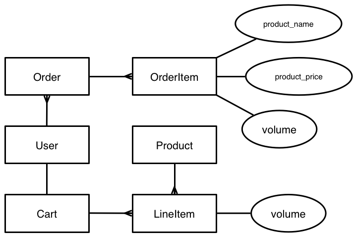

# 購物車實作 <!-- .slide: data-background="../img/5xruby_bg_title.png" -->
### Part 2

---

# ERM <!-- .slide: data-background="../img/5xruby_bg_chapter.png" -->


## 使用者與訂單的關係


1 to many


## 訂單上有產品、數量的資訊


## 錯誤示範


產品價位改變、或產品刪除，不應該影響過去訂單


## 正確設計


訂單的產品名稱與價位應獨立於產品資料庫（類似發票）


```bash
$ rails g model order user:references
$ rails g model order_item \
order:references product_name \
product_price:integer volume:integer
$ rake db:migrate
```


```ruby
# app/models/oder_items.rb
class OrderItem < ActiveRecord::Base
  belongs_to :order
end
```

```ruby
# app/models/order.rb
class Order < ActiveRecord::Base
  belongs_to :user
  has_many :order_items # 手動加上
end
```

```ruby
# app/models/user.rb
class User < ActiveRecord::Base
  has_many :orders # 手動加上
end
```


## 練習
```ruby
# rails console
user = User.first
user.orders
order = user.orders.create
order.order_items
order.order_items.create({
  product_name: 'foo',
  product_price: 100, volume: 2
})
```


## `rake fake:orders`
```ruby
# lib/tasks/fake.rake
desc '創造假的訂單'
task orders: :environment do
  products = Product.all
  User.find_each do |user|
    order = user.orders.create
    products.sample(10).each do |product|
      order.order_items.create({
        product_name: product.name,
        product_price: product.price,
        volume: rand(10) + 1
      })
    end
  end
end
```
<!-- .element: style="font-size: .6em" -->

```bash
$ rake fake:orders
```

---

# 呈現訂單 <!-- .slide: data-background="../img/5xruby_bg_chapter.png" -->


## RESTful 設計網址

情境       | 動詞 | 路徑        | Controller#Action
---------- | ---- | ----------- | -----------------
訂單列表頁 | GET  | /orders     | orders#index
單比訂單頁 | GET  | /orders/1   | orders#show


## RESTful

```bash
$ rails g controller orders index show
```

```ruby
# config/routes.rb
# get 'orders/index'
# get 'orders/show'
resources :orders, only: %i[index show]
```
註解掉不優雅的路由


```ruby
# app/controllers/orders_controller.rb
# GET /orders
def index
  @orders = current_user.orders
end
```

```ruby
# GET /orders/:id
def show
  @order = current_user.orders.find(params[:id])
end
```
<!-- .element: style="font-size: .8em" -->

- 將 `@order` 與 `@orders` 傳給 view 使用
- `@orders = Order.all` 與 `Order.find` 的寫法不安全


加上導覽列：

```no-highlight
<!-- app/views/layouts/_navbar.html.erb -->
<%= nav_li '訂單記錄', orders_path %>
```
<!-- .element: style="font-size: .95em" -->

顯示單一訂單：

```no-highlight
<!-- app/views/orders/show.html.erb -->
<% @order.order_items.each do |order_item| %>
  <%= order_item.product_name %>
  <%= order_item.product_price %>
  <%= order_item.volume %>
<% end %>
```
<!-- .element: style="font-size: .9em" -->

原則：view 的責任只是單純呈現從 controller 送來的資料


## 練習

在單一訂單頁面上：

1. 呈現「小計」
2. 呈現「總計」


顯示訂單列表：

```no-highlight
<!-- app/views/orders/index.html.erb -->
<% @orders.each do |order| %>
  <%= link_to '查看', order, class: 'btn btn-primary' %>
  <%= order.id %>
  <%= order.created_at %>
<% end %>
```
<!-- .element: style="font-size: .75em" -->

---

# Localize <!-- .slide: data-background="../img/5xruby_bg_chapter.png" -->


```no-highlight
<%= localize order.created_at, format: '%Y-%m-%d' %>
<%= l order.created_at, locale: 'zh-TW', format: '%Y-%m-%d' %>
```
<!-- .element: style="font-size: .65em" -->

其中 format 的格式與 `Time#strftime` 格式相同


## `strftime`

```ruby
Time.now.strftime('%Y %m %d') # => "2014 08 08"
Time.now.strftime('%H:%M:%S') # => "02:45:48"
```
<!-- .element: style="font-size: .9em" -->


```no-highlight
<%= l order.created_at, format: :short %>
```
<!-- .element: style="font-size: .95em" -->

rails-i18n 片段：

```yaml
time:
    am: 上午
    formats:
      default: ! '%Y年%b%d日 %A %H:%M:%S %Z'
      long: ! '%Y年%b%d日 %H:%M'
      short: ! '%b%d日 %H:%M'
    pm: 下午
```
<!-- .element: style="font-size: .9em" -->

---

# 購物功能 <!-- .slide: data-background="../img/5xruby_bg_chapter.png" -->


## RESTful 設計網址

情境             | 動詞 | 路徑        | Controller#Action
----------       | ---- | ----------- | -----------------
訂單列表頁       | GET  | /orders     | orders#index
單比訂單頁       | GET  | /orders/1   | orders#show
新增訂單（下訂） | POST | /orders     | orders#create


## 3 步驟

1. 從當前使用者產生一個訂單
2. 將購物車項目逐條複製到訂單
3. 刪除購物車

```ruby
# app/controllers/orders_controller.rb
# POST /orders/:id
def create
  # 1、2 步驟
  current_cart.destroy
  redirect_to order, notice: '訂單已經新增'
end
```
1、2 步驟的程式碼太長，且與商業邏輯高度相關，不適合放在 controller


## 將問題切割

1. 把 LineItem 轉成 OrderItem 的工作由 OderItem 負責
2. 把 Cart 轉成 Order 的工作由 Order 負責


## 從購物車項目產生訂單項目

```ruby
# app/models/order_item.rb
class OrderItem < ActiveRecord::Base
  def self.create_from! line_item
    create! product_name: line_item.product.name,
            product_price: line_item.product.price,
            volume: line_item.volume
  end
end
```
<!-- .element: style="font-size: .8em" -->

```ruby
line_item = LineItem.last
OrderItem.create_for! line_item
```


## 從購物車產生訂單

```ruby
# app/models/order.rb
class Order < ActiveRecord::Base
  def self.create_for! cart
    order = Order.create! user: cart.user
    cart.line_items.each do |line_item|
      order.order_items << OrderItem.create_from!(line_item)
      line_item.product.decrement(:volume, line_item.volume).save!
    end
    order
  end
end
```
<!-- .element: style="font-size: .6em" -->


## `orders#create`

```ruby
# app/controllers/orders_controller.rb
# POST /orders
def create
  order = Order.create_for! current_cart
  current_cart.destroy
  redirect_to order, notice: '訂單已經新增'
end
```
<!-- .element: style="font-size: .95em" -->

下訂按鈕：
```no-highlight
<!-- app/views/carts/show.html.erb -->
<%= link_to '下訂', orders_path, method: :post %>
```
<!-- .element: style="font-size: .8em" -->

---

# Transaction <!-- .slide: data-background="../img/5xruby_bg_chapter.png" -->


可避免「一組 SQL 指令」因中斷而弄亂資料庫

```ruby
# rails console
ActiveRecord::Rollback.transaction do
  Category.create! name: 'Hello'
  Category.create! name: 'World'
  raise ActiveRecord::Rollback # 刻意出錯
end
```


```ruby
# app/models/order.rb
def self.create_for! cart
  ActiveRecord::Base.transaction do
    # 只要出差錯就回溯資料庫
    order = Order.create! user: cart.user
    cart.line_items.each do |line_item|
      line_item.product.decrement(:volume, line_item.volume).save!
      order.order_items << OrderItem.create_from!(line_item)
    end
    order
  end
end
```
<!-- .element: style="font-size: .6em" -->


## 訂單異常處理
```ruby
# app/controllers/orders_controller.rb
# POST /orders
def create
  order = Order.create_for! current_cart
  current_cart.destroy
  redirect_to order, notice: '訂單已經新增'
rescue
  redirect_to order, alert: '訂單無法新增'
end
```
<!-- .element: style="font-size: .95em" -->